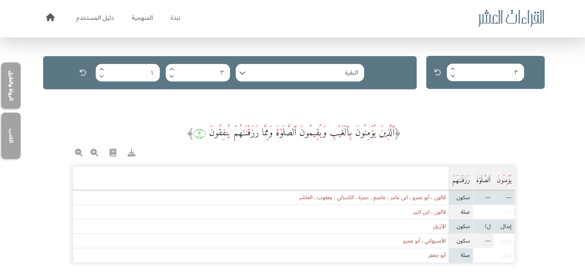

# Alqeraat Alasher – QURANIC Web App

📅 **Development Period:** October 2024 – February 2025  
<p align="center">
  <a href="https://your-hosted-web-link.com" target="_blank">
    
  </a>
</p>

🌐 **Live Demo:** [Visit the Web App!](https://your-hosted-web-link.com) 🔥🔥
> ⚠️ **Important Notes:**  
> - The hosted version uses a **sample database** due to content rights — not the full dataset.  
> - The app may take a few seconds to load on first visit, as it is hosted on a **free server**.


<br><br>

## 📌 Project Description

**Alqeraat Alasher - QURANIC Web App** is a full-stack web platform that helps students and teachers of Quranic recitation (Qira’at) navigate and understand complex variations across the **Ten Qira’at** using a structured and searchable interface.

The application is based on data from the book **"[النشر في القراءات العشر](https://shamela.ws/book/22642)" (al-Nashr fi al-Qira’at al-‘Ashr)** by **Ibn Al-Jazari**, one of the most authoritative sources on Qira’at. This book contains intricate details of **تحريرات القراءات**—subtle variations in pronunciation and recitation that are essential for advanced Quranic studies.


<br><br>

## 💡 Problem It Solves

Traditionally, accessing this knowledge required navigating dense classical texts, reference books, and complex tables. This project simplifies that by:

- 📘 Digitizing the data from the authoritative source: *al-Nashr fī al-Qirā’āt al-‘Ashr* by Ibn Al-Jazari
- 🗃️ Organizing it into a structured MySQL database
- 🌐 Providing a user-friendly web interface to explore and analyze the data efficiently


> ### 🔧 Key capabilities include:

- 🔍 Searching for specific **Khilāfāt** (اختلافات) such as:
  - **Hamz Sākin** (همز ساكن)
  - **Madd Munfaṣil** (مد منفصل)  
  The app dynamically generates tables based on what the user wants to explore — allowing in-depth analysis of how each rule is applied by different Qāri’, Rāwī, and Ṭarīq.

- 🧭 Filtering by:
  - **Qāri’** (Reader)
  - **Rāwī** (Narrator)
  - **Ṭarīq** (Transmission path)

- 📖 Searching how a specific **Āyah in a Sūrah** is read — the app displays all reading variations across the 10 Qira’at for that verse.


> ### 🔍 Real Use Case

For example, a student wants to know how the **Hamzah Sākinah** is pronounced in a certain word by **Imam Qālūn** via **Tariq Abi Nasheet**. Instead of searching multiple pages in a book, they can:

1. Visit the web app
2. Search for the word
3. Filter by Qāri’, Rāwī, or Ṭarīq
4. Instantly view the results


<br><br>

## 📖 Features

- **🔍 Search Qira’at Data**: Search for readings by **Qāri’**, **Rāwī**, and **Ṭarīq**.
- **🔧 Advanced Filtering**: Filter by **Qāri’**, **Rāwī**, or **Ṭarīq**.
- **📜 Instant Rule Display**: View applied rules like **Hamzah Sākinah** and **Madd Munfaṣil**.
- **📖 Ayah Search**: Check how an **Āyah** in a **Sūrah** is read across 10 Qira’at.
- **📊 Interactive Tables**: Dynamic tables based on your search criteria.
- **🌐 User-Friendly Interface**: Easy navigation for students and teachers.
- **📑 Export as PDF**: Download your findings as a PDF report.
- **⚠️ Responsive Feedback**: JavaScript-powered alerts guide users when inputs are missing or actions are invalid.


<br><br>

## 🎥 Web Demo

<p align="center">
  <a href="https://drive.google.com/file/d/199qIqkPnWRw0f8d92UPfGUM1b9IRDjn5/view?usp=sharing" target="_blank">
    
  </a>
</p>
<p align="center">
  
</p>

🔥 [Watch the full demo video here!!](https://drive.google.com/file/d/199qIqkPnWRw0f8d92UPfGUM1b9IRDjn5/view?usp=sharing)


<br><br>
## 🛠️ Tech Stack

- **Backend:** Node.js, Express.js  
- **Frontend:** EJS, CSS, JavaScript, Bootstrap  
- **Database:** MySQL

<br><br>

## 🚀 Getting Started

### 1. Clone the Repository

```javascript
git clone https://github.com/NuhaMakki/Alasher_Alqeraat.git
cd Alasher_Alqeraat
```

### 2. Install Dependencies
```javascript
npm install
```

### 3. Configure the Database
Note: Only a sample Database is included due to content rights.

To connect your own MySQL database, Modify `/config/database.js` to match your MySQL configuration (if needed):

1. Open the configuration file: `/config/database.js`
2. Edit the MySQL settings:

```javascript
const pool = mysql.createPool({
    host: process.env.DB_HOST,         // Database host
    database: process.env.DB_NAME,     // Database name
    user: process.env.DB_USER,         // Database user
    password: process.env.DB_PASSWORD, // Database password
    port: process.env.DB_PORT,         // Database port
    // Additional settings as required
});
```


### 4. Run the Project
```javascript
node index.js
```

By default, the server runs on `http://localhost:3000`.


<br><br>

## ⚠️ Important Notes

- 📦 **Database Not Included**  
  Due to content rights, the full database is **not included** in this repository. Only the web application code is provided.

- 🌐 **Live Demo Notice**  
  - The hosted version uses a **sample/test database**, not the complete dataset.
  - Initial load time may be **slightly delayed** due to limitations of **free hosting services**.


<br><br>

## 📬 Connect

If you have any questions or suggestions, feel free to connect!

<div align="center">

<a href="mailto:noha.m.makki@gmail.com" rel="nofollow">
  
</a>

<a href="https://www.linkedin.com/in/nuha-makki-a3b15a2b9/" rel="nofollow">
  
</a>

<a href="https://github.com/NuhaMakki" rel="nofollow">
  
</a>

</div>


